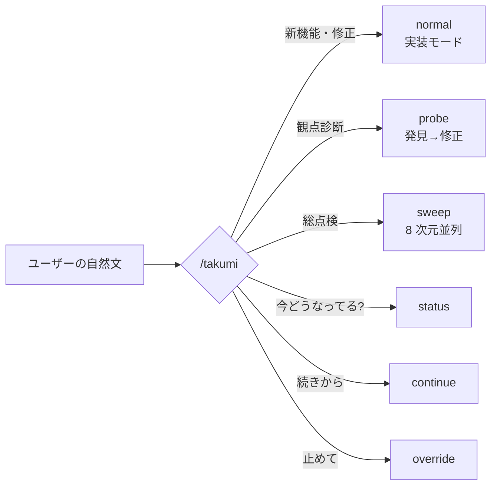
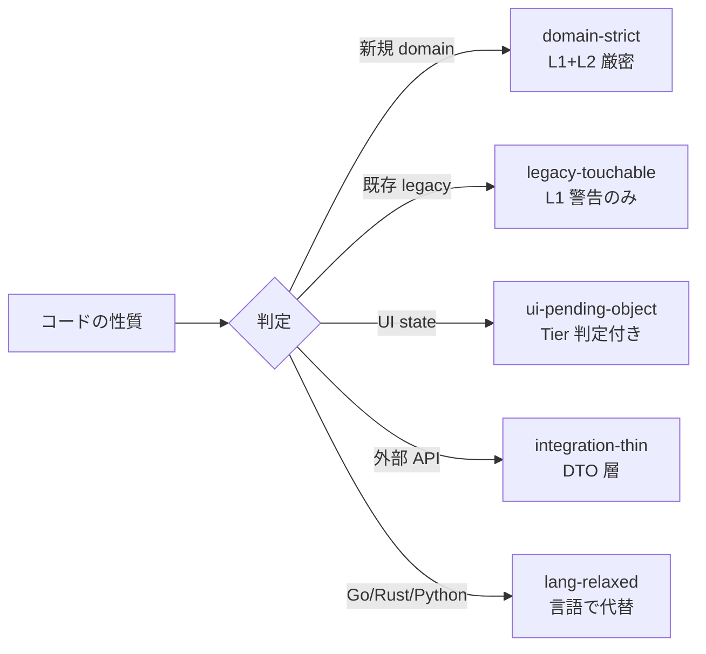
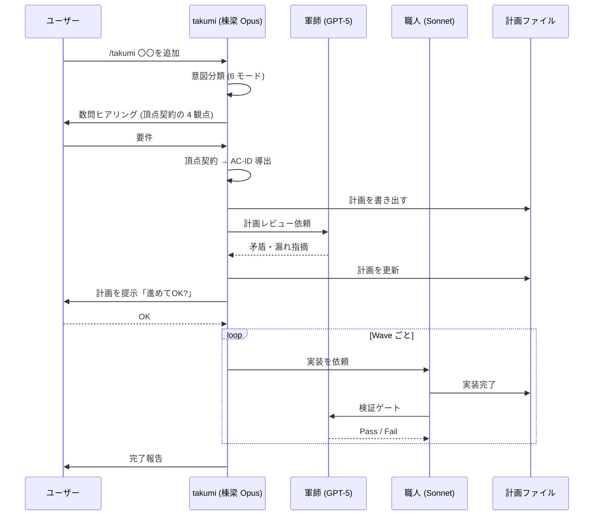

<div align="center">

<picture>
  <source media="(prefers-color-scheme: dark)" srcset="assets/takumi-seal-dark.png">
  
</picture>

# 匠 takumi

**Claude Code で、あなたの開発チームをまるごと 1 つのコマンドに。**

<p align="center">
  <a href="LICENSE"></a>
  <a href="https://docs.claude.com/claude-code"></a>
  <a href="https://github.com/toishi2/takumi/releases"></a>
  <a href="skills/takumi"></a>
  <br>
  
  
  <a href="https://tsugite.toishi.tech"></a>
  <a href="https://toishi.tech"></a>
</p>

</div>

---

> [!IMPORTANT]
> **このリポジトリは takumi の Core Edition です。**
> オープンソース (MIT) で公開しているコア一式で、**継続的にメンテナンスしています** (バグ修正・改善を続けます)。ここにあるものは、そのまま無償でお使いいただけます。
>
> 🏢 **Enterprise 版は「[Tsugite (継手)](https://tsugite.toishi.tech)」として提供中です。** — Core と**同じ入口・同じ設計思想**の上に、**要件定義から伴走する工程**・**署名検証つきの自動更新**・**組織向けの統制 (承認配信・監査ログ・請求書払い)** を積んだ商用版。個人は ¥3,278/月 (税込) からカードで即日、組織は請求書払いで。 &nbsp;→&nbsp; **[プランと価格を見る](https://tsugite.toishi.tech/#pricing)** / [無料版との違い](#core-edition-と-enterprise-版-tsugite)
>
> 🐛 バグ報告・要望・PR は [Issues](../../issues) / [Discussions](../../discussions) へ

---

```
/takumi 管理画面に CSV エクスポート機能を追加
```

このひとことで、要件のヒアリングから設計・実装・テスト作成・レビューまで、シニアエンジニア数名ぶんの仕事が走り出します。

> [!IMPORTANT]
> **30 秒でわかる takumi**
> - **これは何?** — Claude Code に「開発チームまるごと」を足す 1 枚のスキル。人間が覚えるコマンドは `/takumi` ただ 1 つ。
> - **どう動く?** — 日本語で頼むと、要件ヒアリング → 設計 → 実装 → テスト → レビューを、役割の違う複数の AI (棟梁・軍師・職人・斥候) が分担して進めます。
> - **最初の一歩は?** — インストール後、プロジェクトの中で `/takumi 〇〇を追加して` と話しかけるだけ。

> [!TIP]
> **読む順番 (急ぐ方へ)** — まず ①[こんなお悩み](#こんなお悩みありませんか) → ②[できること](#takumi-でできること-8-つの特徴) の**見出しだけ** → ③[インストール](#インストール) → ④[話しかけてみましょう](#実際に話しかけてみましょう) の 4 つを読めば使い始められます (約 2 分)。
> 知らない言葉が出てきたら [用語集](#用語集-はじめての方へ) を引いてください。残りは「必要になったら読む」参照パートです。

---

## 目次

- [こんなお悩み、ありませんか?](#こんなお悩みありませんか)
- [takumi でできること (8 つの特徴)](#takumi-でできること-8-つの特徴)
  - [1. 覚えるコマンドは `/takumi` ひとつだけ](#1-覚えるコマンドは-takumi-ひとつだけ)
  - [2. 仕様を「頂点契約」から導く](#2-仕様を頂点契約から導く)
  - [3. 持っていないレビュー観点が、その場で手に入る](#3-自分が今持っていないレビュー観点がその場で手に入る)
  - [4. この 50 年で一番マシなテスト手法](#4-ここ-50-年で一番マシな方法でテストを書いてくれる)
  - [5. AI がアプリを実際に触って発見する (巡視)](#5-ai-がアプリを実際に触って人間以上に発見する-巡視)
  - [6. 設計の知恵をルール化](#6-リファクタリングに人類が長年積み上げてきた知恵を込めてあります)
  - [7. 計画ファイル化で長時間運転](#7-計画ファイル化で放置してもずっと動き続けます)
  - [8. 5 ロールを使い分け](#8-5-つのロールがそれぞれ得意分野で動く)
- [用語集](#用語集-はじめての方へ)
- [インストール](#インストール)
- [プロンプト例](#実際に話しかけてみましょう)
- [他ハーネスとの違い](#他のハーネスとの違い)
- [裏側でなにが起こっているか](#裏側でなにが起こっているか)
- [よくあるご質問](#よくあるご質問)
- 🏢 [Core Edition と Enterprise 版 Tsugite (提供中)](#core-edition-と-enterprise-版-tsugite)

---

## こんなお悩み、ありませんか?

AI コーディング支援ツール (Claude Code、Cursor、Cline、Aider など。こうしたツールはまとめて「**ハーネス**」と呼ばれます) を使っていると、こんな壁にぶつかることがあります。

| お悩み | 心当たり? |
|---|---|
| AI に実装を頼んでも、テストが甘くて本番で壊れる | ✓ |
| セキュリティ・パフォーマンスの観点を、ひとりで見きれない | ✓ |
| 大きな機能を任せると、途中で話が脱線する | ✓ |
| 長時間の作業を任せたいが、席を外すと止まってしまう | ✓ |
| 仕様・画面・テストの前提がバラバラで、後から噛み合わない | ✓ |
| テストは緑なのに、実際に画面を触ると崩れている・使いにくい | ✓ |
| コマンド・スキルが多すぎて、いつ何を使うのか覚えきれない | ✓ |
| AI が書いたコードを、どうレビューすればいいのか迷う | ✓ |

takumi は、これらの課題を Claude Code の標準機能の上に積み上げた 1 枚のスキルで解決します。

---

## takumi でできること (8 つの特徴)

> [!NOTE]
> **急ぐ方は、この 8 つの見出しを眺めるだけで全体像がつかめます。** 各特徴の本文は「もっと知りたくなったら」読めば十分です。

### 1. 覚えるコマンドは `/takumi` ひとつだけ

> [!NOTE]
> AI 開発ツールはコマンドが増える傾向にあります。Claude Code 標準でも `/plan`、`/review`、`/security-review` があり、Cursor には Composer、Cline には Plan / Act Mode と、ハーネスごとに異なる概念を覚える必要があります。

takumi は逆の発想です。**入り口を `/takumi` 1 つに絞り、自然な日本語を投げるだけで、中で自動的にモード分岐します。**



**こう話しかけると、中ではこう動きます:**

| こう話しかけると | 中ではこう動きます |
|---|---|
| `/takumi 商品一覧にソートを追加` | 新機能を実装するモード |
| `/takumi security 見て` | セキュリティ観点で診断するモード |
| `/takumi リリース前に全般見て` | 全方位で総点検するモード |
| `/takumi 今なに動いてる?` | 現在の状態を確認 |
| `/takumi 続きから` | 前回の途中から再開 |
| `/takumi 止めて` | 一時停止 |

命令を丸暗記する必要はありません。「こう言えばこう動くかな」という直感でおおむね通じます。

> [!TIP]
> **「聞きすぎ」も「聞かなすぎ」も防ぎます。** AI に毎回こまかく確認されると面倒、かといって誤解したまま突っ走られても困ります。takumi は依頼の曖昧さ・影響範囲・後戻りのしにくさから「質問予算」を見積もり、**本当に迷うところだけを最小限聞く**よう調整します (内部の仕組み: [`skills/takumi/qbc.md`](skills/takumi/qbc.md))。

---

### 2. 仕様を「頂点契約」から導く

**これはブレない開発の「背骨」です。** 大きな機能を AI に小さく分けて実装させると、各パーツがそれぞれ別の前提で作られ、後から噛み合わない——よくある失敗です。takumi はこれを **「頂点契約 (TopContract)」** という考え方で防ぎます。

> [!IMPORTANT]
> 機能ごとに、まず **頂点契約**を 1 つ決めます。これは「この機能で絶対に崩れてはいけないドメインのルール」と「ユーザーが達成したいこと」を言語化したものです。**画面 (UI)・API・テストは、すべてこの契約から導出**されます。画面を出発点にしないのがポイントです (画面から始めると、ドメインの暗黙ルールが言語化されず仕様漏れになるため)。

頂点契約は 2 つの部品でできています。

| 部品 | 中身 | 例 |
|---|---|---|
| **ドメイン不変条件** (I1-I6) | いつでも真であるべきルール | 「確定済の注文には必ず顧客 ID がある」「在庫は負にならない」 |
| **ユーザータスク契約** (T1-T4) | ユーザーが達成したいことと、その例外 | 「注文をキャンセルできる。ただし出荷後は不可、在庫は戻る」 |

ここから機能の受け入れ条件 (**AC-ID**) が原子単位で切り出され、**仕様・計画・テスト・レビューを貫く共通言語**になります。`AC-ORDER-003` のような ID が一度決まれば、計画書もテストも同じ ID を指すので、ズレようがありません。

> [!TIP]
> **ヒアリングで AI が必ず聞く 4 つの観点**があります — 禁止状態 (やってはいけないこと) / 例外業務 (うまくいかない時) / 権限境界 (誰が操作できるか) / 状態整合性 (並行編集・丸め・監査)。ここを最初に潰すことで、後から「そういえばこのケースは?」という手戻りが激減します。仕組みの詳細は [`skills/takumi/contract/contract-spine.md`](skills/takumi/contract/contract-spine.md)。

つまり takumi は「バグをゼロにする」のではなく、**「仕様の漏れを早い段階で炙り出し、人間のレビューを“本当に危ない差分”だけに集中させる」**ことを狙っています。

---

### 3. 「自分が今持っていないレビュー観点」がその場で手に入る

一人前のエンジニアになるには、実装力だけでなく、コードを多角的に読む「レビュー観点」を身につける必要があります。たとえば次のようなものです。

- **セキュリティレビュー** — SQL インジェクション、権限昇格、CSRF といった攻撃経路を見抜く観点
- **パフォーマンスレビュー** — N+1 クエリ (1 件ごとに DB を叩いてしまう問題)、不要な再レンダリング、メモリリーク
- **アクセシビリティレビュー** — WCAG (Web Content Accessibility Guidelines) への準拠、スクリーンリーダー対応、キーボード操作
- **リファクタリングレビュー** — 責務分離、依存の向き、命名の適切さ
- **テスト戦略レビュー** — 何をどの層で守るのか、不要なテストはないか

これらをすべて高い水準で維持するのは、10 年選手でも難しいことです。

> [!IMPORTANT]
> takumi には、これらの観点に対応する専門モジュールが内蔵されています。`/takumi security 見て` と話しかけるだけで、該当するレビューが自動で走ります。

| 内蔵モジュール | 役割 |
|---|---|
| **strict-refactoring** | リファクタリング・設計指針 |
| **verify** | テスト戦略 (L0 型規律 + L1-L6 実行時の 7 層) |
| **design** | UI の情報設計・スタイルガイド・ワイヤーフレーム (+ 「凡庸でない」Craft 層) |
| **probe** | 観点指定の発見→修正 |
| **sweep** | 8 次元並列の総点検 |
| **junshi (巡視)** | アプリを実際に走らせて挙動・見た目の問題を発見 (特徴 5) |
| **verify-loop** | mutation score 長時間積み上げ |

つまり、**これまでチームに居なかった専門家が、会話ひとつで一時的に加わるような体験**です。まだ経験が浅くても、シニアが隣でレビューしているのと同じような観点で、自分のコードを見てもらえます。

---

### 4. ここ 50 年で一番マシな方法でテストを書いてくれる

少し丁寧にご説明させてください。ソフトウェアテストは歴史的に、次のような流れをたどってきました。

> [!WARNING]
> **昔ながらのテスト (example-based unit test)** — 「入力 A を渡したら B が返ること」を 1 つずつ書く方式。人間が思いついた入力しか試せないので、境界値や組み合わせの漏れが起きやすい。

> [!WARNING]
> **カバレッジ至上主義** — 「テストで実行されたコード行の割合」を 80% などの目標で管理する方式。しかし、行が実行されていても assert が甘ければ何も守れていない。**研究によると、カバレッジ 80% でもバグの 30% 以上を見逃す**ことが知られています。

**ここ 50 年で研究者たちが提案してきた、本当にいい指標たち:**

| 手法 | 概要 | 発表年 |
|---|---|---|
| **Mutation Testing** | 本番コードを少しずつ書き換え (`>` → `>=` 等)、そのバグをテストが検知できるかで鋭さを測る | 1971 |
| **Property-Based Testing (PBT)** | 「どんな入力でも成り立つ性質」を書き、ライブラリが 1 万件ランダム生成して試す | 1999 (QuickCheck) |
| **Metamorphic Testing** | 正解がない領域で、入力の変換と出力の関係で検証する (画像・ML・LLM) | 1998 |
| **Model-Based Testing** | 状態機械を書いて、操作列をランダム生成して試す | 1990 年代 |

> [!CAUTION]
> **これらが普及してこなかった理由はひとつで、人間が使うには難しすぎたからです。**
> 「どんな入力でも成り立つ性質」を言語化するのも、正解のない出力に「関係」を定義するのも、状態機械を正しく設計するのも、かなりの専門性を要求します。

AI によってその障壁がほぼ消えました。takumi は仕様 (前述の **AC-ID**) と関数シグネチャから、これらのテストを自動生成します。ユーザーがやることは **「何を守りたいか」を日本語で伝えること**、それだけです。

> [!TIP]
> **1 unit = 1 test file = 仕様書**。生成されるテストは `.pbt.test.ts` / `.mutation.test.ts` 等に分割せず、`{module}.test.ts` 1 本に統合され、各 `it('{Subject} は {input} に対して {output} を返すべき')` が**仕様文**として読めます。機構 (PBT, metamorphic) は it body の中で選ばれる実装詳細であって、ファイル名に漏らしません。詳細は [`skills/takumi/verify/spec-tests.md`](skills/takumi/verify/spec-tests.md)。

> [!IMPORTANT]
> **Mutation Testing の対応言語は tier で分かれます**。JS/TS (Stryker-JS) / Java/Kotlin (PIT) / C# (Stryker.NET) / Rust (cargo-mutants) / Scala (Stryker4s) は **primary** (mutation score を hard gate に使える)、Python (mutmut) / Go (gremlins) は **advisory** (operator 覆盖が不足するため telemetry 参考値のみ、主守りは PBT + AI Review)、その他言語は **L4 skip**。詳細は [`skills/takumi/verify/mutation.md`](skills/takumi/verify/mutation.md) の「対応言語と tier」。

> [!NOTE]
> **これら実行時テストの“下”に、もう 1 段あります (L0-type)**。正しい型はコンパイル時に成立する証明で、無数の runtime example より安く強い守りです。`any` / `as` / non-null `!` を抑制し、illegal state を型で表現不能にすることで、その分の実行時テストを丸ごと不要にします。verify ラダーは **L0 (型規律) + L1-L6 (実行時)** の構成です。詳細は [`skills/takumi/verify/type-discipline.md`](skills/takumi/verify/type-discipline.md)。

---

### 5. AI がアプリを実際に触って人間以上に発見する (巡視)

テストが全部緑でも、実際に画面を開くとボタンが重なっていたり、操作してみると妙に使いにくかったり——こうした問題は、これまで人間がアプリを「ぽちぽち」触って見つけるしかありませんでした。**巡視 (じゅんし)** は、これを機械化する takumi の発見エンジンです。

> [!IMPORTANT]
> 巡視の核心は「スクショを撮ること」ではありません。人間のぽちぽちレビューが強いのは、頭の中に**「こうあるべき」という仕様モデル**を持っていて、現実とのズレに気づくからです。巡視は特徴 2 の **頂点契約 (TopContract) を“正解を知る装置 (オラクル)”として使い**、見つけた違和感を「なんとなく変」ではなく**「契約への違反」**として根拠づけます。

仕組みは、アプリを実際に走らせて画面・DOM・操作ログを**使い捨てで**撮り、4 種類のオラクルと照らし合わせる、というものです。

| オラクル | 「正しい」の基準 | 何を捕まえるか |
|---|---|---|
| **仕様** | 頂点契約から導いた AC | 状態や出力が仕様と食い違う |
| **差分** | 前のビルド / 似た画面 | 仕様で説明できない変化 = 回帰 (デグレ) |
| **変換不変 (metamorphic)** | 変換しても変わらないはずの性質 | 「戻る→進む」で元に戻らない等 |
| **趣き** | デザイン品質ルーブリック | 要素の重なり・見切れ・空/エラー状態の抜け (※参考情報扱い) |

> [!TIP]
> **メンテ地獄になりません。** 壊れやすい E2E テストを大量に保存する代わりに、操作手順 (journey) も証拠 (スクショ等) も**毎回作り直して捨てます**。永続化するのは「確証が取れた発見」だけで、それは AC-ID や通常のテストに昇格して回帰を守ります。仕様が変われば手順は自動で追従するので、腐りようがありません。

2 つの使い方があります。

```
/takumi イシューだけ洗い出して      ← 採取モード (探して起票したら止まる。コードは直さない)
/loop 30m /takumi 巡視             ← 常駐ループモード (一定間隔で自動発火し、発見し続ける)
```

> [!NOTE]
> 巡視は **pilot-gated** (効果を測る試験運用ゲートを通った範囲) で慎重に有効化される機能です。詳しくは [`skills/takumi/junshi/README.md`](skills/takumi/junshi/README.md)。

---

### 6. リファクタリングに人類が長年積み上げてきた知恵を込めてあります

リファクタリングや設計判断は「正解がない」と言われがちですが、実際には**コミュニティが長年かけて発見してきた、より良いパターン**というものが存在します。

<table>
<tr>
<th>パターン</th>
<th>発祥</th>
<th>要点</th>
</tr>
<tr>
<td><b>OOP</b></td>
<td>1970 年代</td>
<td>カプセル化・責務分離</td>
</tr>
<tr>
<td><b>関数型 (FP)</b></td>
<td>1950 年代〜</td>
<td>純粋関数、副作用の分離</td>
</tr>
<tr>
<td><b>DDD</b></td>
<td>2003 年 Evans</td>
<td>ドメインを中心に設計</td>
</tr>
<tr>
<td><b>CQRS</b></td>
<td>2010 年頃〜</td>
<td>Command と Query を分離</td>
</tr>
<tr>
<td><b>Pending Object Pattern</b></td>
<td>UI state 管理</td>
<td>中間状態を validate してからコミット</td>
</tr>
</table>

takumi の **strict-refactoring モジュール**は、これらの蓄積をチェックリストとして持っています。しかもコンテキストに応じて**強度を可変**にします。



「教科書には書いてあるけれど現場では守れない」というパターンを、場所と状況に応じて柔軟に運用します。

> [!NOTE]
> UI を伴う機能では、design モジュールが「画面が**崩れない**」ことに加えて「**凡庸でない** (プロが組んだように見える)」ことも守ります。色数・余白・視覚階層・日本語組版などを、好みではなく**制約**として与えることで AI っぽさを減らします。詳細は [`skills/takumi/design/craft-layer.md`](skills/takumi/design/craft-layer.md)。

---

### 7. 計画ファイル化で放置してもずっと動き続けます

大きな機能を AI に頼むと、最初は調子よく進むのに、途中から話が脱線したり、文脈を見失ったりする経験、ありませんか?

> [!IMPORTANT]
> takumi は会話を始めてすぐ、やることを `.takumi/plans/{機能名}.md` というテキストファイルに書き出します。これが強みの源泉です。

**ファイル化には 3 つの利点があります。**

> [!NOTE]
> **A. いつでも再開できます** — セッションが切れようと、PC を閉じようと、`/takumi 続きから` のひとことで続きに戻れます。AI が持っていた作業記憶は計画ファイルに吐き出されているので、再読み込みするだけで続きが走ります。

> [!NOTE]
> **B. 長時間の自動運転に強いです** — 100 個以上のタスクに膨らんだ大きな計画でも、Wave ごとに検証ゲートを通しながら進むので迷子になりません。寝る前に `/takumi リリース前の総点検` と投げて、朝コーヒーを淹れるころには 50 件の問題が片付いていた、ということが現実に起こります。

> [!NOTE]
> **C. 人間がレビューできます** — AI がコードを書き始める**前**に、計画のテキストを人間が読んでレビューできます。「Wave 3 の認可タスクは粒度が粗い、2 つに分けて」のようなフィードバックが自然に返せます。

**「無人で進める」と「勝手に危ないことをされない」を両立させる安全装置**もあります。takumi は作業の自律レベルを 3 段階で切り替えられます。

| 自律レベル | 計画の承認 | 用途 |
|---|---|---|
| `autonomous` (既定) | 危険でなければ無人で進む | 完全にお任せ |
| `gated` | 計画を 1 回だけ人間に確認 | 計画だけ目を通したい |
| `manual` | 各ゲートで人間が承認 | 慎重に運用 |

> [!CAUTION]
> どのレベルでも、**「後戻りできない操作」は必ず人間の承認を求めます** (これを human floor と呼びます)。本番 DB への書き込み・デプロイ・課金/認証設定の変更・secret のローテーション・migration の実行などは、AI が「進めてよい」と判断しても止まって人間を待ちます。**安全側に倒すのが大原則**です。仕組みは [`skills/takumi/dispatch/autonomy.md`](skills/takumi/dispatch/autonomy.md)。

また、大きな総点検では**自己増殖型計画**になります。実装中に見つけた別の問題は `discovered-{id}.md` に記録され、Wave 完了時に計画に追記されます。**計画そのものが、作業しながら成長していきます。** 規模が非常に大きい場合 (数十日規模・タスク 50 件超) は **Sprint モード**に切り替わり、「計画 → 実装 → 発見」の 3 フェーズを繰り返す Cycle で回します (詳細: [`skills/takumi/sprint/sprint-mode.md`](skills/takumi/sprint/sprint-mode.md))。

---

### 8. 5 つのロールがそれぞれ得意分野で動く

takumi は内部で、役割に応じて 5 種類の AI エージェントを使い分けます (職人は状況に応じて 2 種のモデルを使い分けます)。

| ロール | モデル | 担当 | ポイント |
|---|---|---|---|
| **棟梁** (とうりょう) | Claude Opus 4.8 | 全体設計・計画作成・会話の中心・ゲート判定 | 小規模は自分で直接実装 (subagent 抑制) |
| **軍師** (ぐんし) | 別系統 LLM (GPT-5 系。入手不可時は Opus 自己レビューに降格) | 敵対的レビュー | 別系統モデルで交差レビュー (下記「制限事項」参照) |
| **職人 (Sonnet)** (しょくにん) | Claude Sonnet | 実装・テスト作成 (既定) | 手を動かす主力 |
| **職人 (GPT-5.5)** | OpenAI GPT-5.5 | 実装 (利用可能時のみ、一部カテゴリ) | 不可時は職人 (Sonnet) に自動降格 |
| **斥候** (せっこう) | Claude Haiku | コードベース探索 | 軽量で高速 |

> [!TIP]
> **軍師** が特に大事です。同じモデル系列に頼ると、同じクセで同じ見落としをします。**別系統のモデル (GPT-5 系)** にクロスレビューを依頼することで、「ある AI には見えなかった問題」が見えるようになります (GPT-5 系が使えない環境では Opus の自己レビューに降格します。下記「制限事項」参照)。

---

> [!TIP]
> **ここまでが、無料の Core Edition でできることです。**
> 「作る前に、何を作るべきかを揉む工程」まで任せたい方・チームで統制して配る必要がある方には、商用版 **[Tsugite (継手)](https://tsugite.toishi.tech)** を提供中です。同じ入口・同じ設計思想の上に要件定義の伴走・署名検証つき自動更新・組織向けの統制を積んだもので、導入は 1 コマンド。
> **→ [Tsugite のプランと価格を見る](https://tsugite.toishi.tech/#pricing)** ・ [違いを表で見る](#core-edition-と-enterprise-版-tsugite)

---

## 用語集 (はじめての方へ)

takumi の説明に出てくる用語を、その場で引けるようにまとめました。**最初から覚える必要はありません** — 困ったときに戻ってきてください。

| 用語 | 意味 |
|---|---|
| **ハーネス** | AI コーディング支援ツールの総称 (Claude Code / Cursor / Cline / Aider など) |
| **モード** | takumi が自然文から自動で選ぶ動作の型。normal (実装) / probe (観点診断) / sweep (総点検) / status / continue / override の 6 種 |
| **棟梁・軍師・職人・斥候** | 役割の異なる 5 つの AI ロール。それぞれ計画 / レビュー / 実装 / 探索を担当 (特徴 8) |
| **頂点契約 (TopContract)** | 機能ごとの「絶対に崩してはいけないドメインのルール + ユーザーがやりたいこと」。画面・API・テストはここから導かれる (特徴 2) |
| **AC-ID** | Acceptance Criteria (受け入れ条件) の ID。`AC-AUTH-002` のような形で、仕様・計画・テスト・レビューをつなぐ共通言語 |
| **Wave** | 計画を分割した実行の単位。Wave ごとに検証ゲートを通して進む |
| **probe (観点診断)** | 「security 見て」のように観点を指定して、まず発見だけ行うモード (コードは触らない) |
| **sweep (総点検)** | 「全般見て」で 8 次元を並列に棚卸しするモード |
| **巡視 (じゅんし)** | アプリを実際に走らせ、使い捨ての証拠をオラクルで照合して挙動・見た目の問題を見つける発見エンジン (特徴 5) |
| **オラクル (oracle)** | 「何が正しいか」を知っている装置 (テスト工学用語)。巡視は頂点契約をオラクルにする |
| **mutation score** | わざと植えたバグ (ミュータント) をテストが検知できた割合。カバレッジより鋭い品質指標 |
| **PBT (Property-Based Testing)** | 「どんな入力でも成り立つ性質」を書き、ライブラリがランダム入力を大量生成して試す手法 |
| **自己増殖型計画** | 作業中に見つけた別の問題を計画に書き戻し、計画自体が成長していく方式 |
| **autonomy (自律レベル)** | 無人でどこまで進めてよいかの設定。autonomous / gated / manual の 3 段階 (特徴 7) |
| **human floor** | 後戻りできない操作 (デプロイ・本番 DB 書込・課金変更など) は必ず人間承認を求める安全装置 |
| **Sprint モード** | 超大規模向けに「計画 → 実装 → 発見」の 3 フェーズを繰り返す運転方式 |

---

## インストール

> [!IMPORTANT]
> **前提**: [gh CLI](https://cli.github.com/) v2.90.0 以上

```bash
gh skill install toishi2/takumi
```

Claude Code を開いて、スラッシュコマンドの補完に `/takumi` が出てくれば成功です。

```bash
# 中身を事前に確認したいとき
gh skill preview toishi2/takumi takumi

# アンインストール
gh skill uninstall takumi
```

> [!NOTE]
> **すでに `NAM-MAN/takumi` から入れている方へ** — takumi の公開場所は **`toishi2/takumi`** に移動しました。
> **すでにインストール済みの `/takumi` はそのまま動きます**（スキル名もコマンドも変わりません）。旧パス `NAM-MAN/takumi` も当面はリダイレクトで動作しますが、今後の更新を確実に受け取るため、次のタイミングで新パスへ切り替えることを推奨します:
> ```bash
> gh skill uninstall takumi
> gh skill install toishi2/takumi
> ```

> [!NOTE]
> **toishi 連携をお使いだった方へ** — 要件定義 SaaS toishi のサービス終了に伴い、v3.0.0 で外部要件 source 連携 (旧 `toishi-integration.md`、G1.5 gate) を撤去しました。
> `.takumi/project.yaml` の `requirements:` セクションは読まれなくなり、残っていても無害です。`.takumi/adapters/` の adapter、`.takumi/agreements/` の snapshot、specs frontmatter の `*_acceptance_check_id` / `*_snapshot_id` は手動で削除して構いません。
> Core 内の AC 起草と design mode 自体は従来どおり内部生成で継続します。廃止されるのは外部 SaaS との要件同期 (snapshot 取り込み・adapter 由来の Given/When/Then 分解) と承認状態による着手 gate です。

---

## 実際に話しかけてみましょう

インストール後、プロジェクトのルートで `/takumi` とだけ送ると、プロジェクトの種別 (UI を含むか、バックエンドのみかなど) を 1 問だけ聞かれます。そこから先は自然文で構いません。

<details>
<summary><b>新機能を作りたいとき</b> (クリックで展開)</summary>

```
/takumi Stripe 決済を追加。単発購入のみ、サブスクリプションはなし
/takumi ユーザー削除に GDPR 対応の論理削除と cascade を入れる
/takumi 記事投稿画面に 10 秒ごとの下書き自動保存を追加
/takumi 管理画面の商品一覧にソート・フィルター・CSV エクスポート
/takumi Webhook エンドポイントに署名検証を追加
```
</details>

<details>
<summary><b>既存のバグを直したいとき</b></summary>

```
/takumi ログイン後の遷移が遅い、原因を調べて直して
/takumi N+1 が出てそうな API を探して修正
/takumi 検索が壊れている。特定の入力で 500 になる
/takumi 通知メールの文面を刷新したい。既存の雰囲気は崩さずに段階的に
```
</details>

<details>
<summary><b>観点別に診断したいとき (コードは触らずに、まず調べる)</b></summary>

```
/takumi security 見て
/takumi 認可ロジック、権限昇格の抜けがないか調べて
/takumi パフォーマンスが心配。遅い top 5 の endpoint を洗い出して
/takumi a11y 調べて。WCAG AA で落ちそうなところ
/takumi 並行編集が怪しい。レースコンディションの可能性ある?
```

> [!NOTE]
> 観点診断モードではまず**発見**だけを行い、`.takumi/sprints/{日付}/discoveries.md` に結果を書き出します。そのうえで「提案 1 と 3 だけ直して」と指示すれば、修正計画の生成に進みます。いきなりコードを触らないので、様子見に最適です。
</details>

<details>
<summary><b>アプリを実際に触って発見してほしいとき (巡視)</b></summary>

```
/takumi イシューだけ洗い出して。直さなくていいから
/takumi 実際に画面を触って、崩れてるところ・使いにくいところを見つけて
/loop 30m /takumi 巡視
```

> [!TIP]
> 「イシューだけ」「起票だけ」は採取モード (探して止まる)。`/loop 30m /takumi 巡視` は常駐ループ (一定間隔で自動発火) です。詳細は特徴 5。
</details>

<details>
<summary><b>リリース前に総点検したいとき</b></summary>

```
/takumi リリース前に全般見て
/takumi 総点検。security、パフォーマンス、a11y、dx 全部
/takumi 来週リリースなのでリリースブロッカーだけ洗い出して
```
</details>

<details>
<summary><b>リファクタリング・設計相談</b></summary>

```
/takumi この UserService、責務が多すぎる気がする
/takumi 状態管理が複雑化してきた。整理できる?
/takumi 既存の checkout 画面、リファクタ観点で見直して
```
</details>

<details>
<summary><b>テストを強化したいとき</b></summary>

```
/takumi PricingCalculator に PBT を追加して mutation score を 80% 以上にして
/takumi この feature のテスト戦略を提案して
/takumi 画像リサイズ関数、正解がないので metamorphic な性質で守って
```
</details>

<details>
<summary><b>デザインを含む新機能 (UI 設計から)</b></summary>

```
/takumi SaaS の pricing page を作って。参考: Linear、Vercel。トーン: 落ち着いた monochrome
/takumi 管理画面のダッシュボードをダークモード対応に刷新
```
</details>

<details>
<summary><b>運用コマンド (無人運転の調整も含む)</b></summary>

```
/takumi 今なに動いてる?
/takumi 続きから
/takumi 止めて
/takumi auth の loop だけ止めて、mutation loop は続けて
/takumi autonomy を gated に (計画だけ確認させて)
```
</details>

---

## 他のハーネスとの違い

Cursor、Cline、Aider、Continue.dev など、モードや計画の概念自体は既に各ハーネスに存在します。takumi の立ち位置を比較します。

|  | Cursor Composer | Cline Plan/Act | Aider /architect | **takumi** |
|---|:-:|:-:|:-:|:-:|
| モード選択 | ユーザー | ユーザー | ユーザー | **自然文から自動推定** |
| 計画の永続化 | セッション内 | セッション内 | セッション内 | **ファイルとして git 管理** |
| セッション跨ぎ再開 | 限定的 | 限定的 | 限定的 | **`続きから` 1 語で復元** |
| 仕様の一貫性 | なし | なし | なし | **頂点契約 + AC-ID で貫通** |
| テスト戦略の内蔵 | なし | なし | なし | **PBT / mutation / metamorphic** |
| リファクタ指針の内蔵 | なし | なし | なし | **CQRS / DDD / Pending Object** |
| 実走行での発見 | なし | なし | なし | **巡視 (アプリを実際に触る)** |
| 無人運転の安全装置 | なし | なし | なし | **autonomy + 不可逆操作の human floor** |
| 別モデルの交差レビュー | なし | なし | なし | **軍師ロール (GPT-5 系、入手不可時は Opus 降格)** |

> [!TIP]
> takumi は Claude Code の上に乗るスキルで、Claude Code 自体を置き換えるものではありません。**むしろ Claude Code の標準機能を前提に、その上で「長時間・大規模・高品質」を実現するための仕組みを積んでいる、と捉えてください。**

> [!NOTE]
> ここまでの比較はすべて**無料の Core Edition** の話です。**「実装の前」— 何を作るべきかを揉む工程まで含めて任せたい方**には、同じ入口・同じ設計思想の上に要件定義の伴走と組織向けの統制を積んだ商用版 **[Tsugite](https://tsugite.toishi.tech)** を提供中です → [違いを見る](#core-edition-と-enterprise-版-tsugite)

---

## 裏側でなにが起こっているか

気になる方向けに、takumi が自然文を受けてからの内部フローをご紹介します。



内部の詳細は [skills/takumi/SKILL.md](skills/takumi/SKILL.md) をご覧ください。

---

## よくあるご質問

<details>
<summary><b>Q. Claude Code 以外のハーネス (Cursor、Cline、Aider など) でも使えますか?</b></summary>

現時点では Claude Code 専用です。takumi は Claude Code の skills システムの上に成り立っているため、同等の仕組みがない環境では動きません。将来的な移植可能性は検討中です。
</details>

<details>
<summary><b>Q. 日本語以外でも動きますか?</b></summary>

動きますが、意図分類の辞書が日本語に最適化されています。英語でも動作はしますが、観点語・診断動詞のマッチ精度はやや落ちます。`natural-language.md` に辞書を足すことで改善できます。
</details>

<details>
<summary><b>Q. 途中で止めたら、書きかけのコードはどうなりますか?</b></summary>

Wave 単位で中断されるため、完了済みの Wave の成果物は残り、途中だった Wave は破棄されます。次回 `/takumi 続きから` で、その Wave の冒頭から再開されます。
</details>

<details>
<summary><b>Q. どこにファイルが書かれますか? 既存コードは勝手に触られませんか?</b></summary>

takumi が書くファイルは `.takumi/` 配下のみです。既存コードは、ユーザーが明示的に「実装して」と頼んだときだけ変更されます。観点診断モードでは 1 行も触りません。
</details>

<details>
<summary><b>Q. 「無人で進める」と言いますが、勝手に危ないことをされませんか?</b></summary>

されません。autonomy が既定の `autonomous` でも、**後戻りできない操作 (human floor)** だけは必ず人間の承認を待ちます。具体的には、本番/共有 DB への書き込み・migration 実行・デプロイ/公開・課金や認証の設定変更・secret の発行/失効・CI/CD の有効化・外部 API への書き込みなどです。`.github/workflows/` や `migrations/`、`.env` といった「触ると影響が大きい場所」への変更も、機械的に人間承認へ回されます。慎重に運用したい場合は `/takumi autonomy を gated に` で計画段階の確認を挟めます。
</details>

<details>
<summary><b>Q. 頂点契約 (TopContract) や AC-ID は、自分で書く必要がありますか?</b></summary>

いいえ。どちらも AI がヒアリングの中から抽出して提示します。ユーザーは一覧を見て OK / 修正を返すだけで大丈夫です。頂点契約はドメインのルール (I1-I6) とユーザータスク (T1-T4) を言語化したもの、AC-ID (`AC-ORDER-003` のような形) はそこから切り出した原子単位の受け入れ条件で、**仕様・計画・テスト・レビューをつなぐ共通言語**になります。
</details>

<details>
<summary><b>Q. 巡視 (じゅんし) は普通の E2E テストと何が違いますか?</b></summary>

E2E テストは「壊れやすいスクリプトを保存し続ける」のがメンテ地獄の原因です。巡視は逆で、操作手順も証拠 (スクショ/DOM/trace) も**毎回作り直して捨てます**。永続化するのは確証が取れた発見だけで、それは AC-ID や通常テストに昇格します。また、ただ撮るのではなく**頂点契約をオラクル (正解の基準) として照合**するので、「なんとなく変」ではなく「契約への違反」として根拠づけられます。`/takumi イシューだけ洗い出して` で起動します。
</details>

<details>
<summary><b>Q. mutation score の目標値はいくつですか?</b></summary>

takumi のデフォルトは 65-80% の幅です。新規のドメインコードでは 80% 以上、既存レガシーに手を入れる場合は 65% など、プロジェクトの状況に応じて profile で可変です。`mutation_floor` を下回る場合は、次の Wave に進みません。
</details>

<details>
<summary><b>Q. <code>.takumi/</code> はコミットすべきですか? 個人開発とチーム開発で違いますか?</b></summary>

**デフォルトは `.takumi/` 全体を `.gitignore`** にします。プロジェクトルートを clean に保ち、中間状態がリポジトリに混入しないようにするためです。個人開発ではこのまま運用してください。

チームで運用する場合、以下のディレクトリは **必要に応じて個別に unignore** できます:

| ディレクトリ | 個別 unignore | 理由 |
|---|:-:|---|
| `plans/` | 候補 | PR に添えてレビュー対象にしたい場合 |
| `specs/` | 候補 | AC-ID をチームの契約 (source of truth) としたい場合 |
| `design/` | 候補 | デザイン成果物をチームで共有したい場合 |
| `profiles/verify/` `profiles/design/` | 候補 | チーム共通の基準を共有したい場合 |
| `profiles/env.yaml` | ❌ | 軍師 routing の user 固有 preference (個人環境依存、共有しない) |
| `sprints/` | ❌ | セッション固有、共有しても雑音 |
| `telemetry/` | ❌ | 内部メトリクス、history が個人差依存 |
| `control/` | ❌ | 一時的な指示、session ごとに使い捨て |
| `drafts/` / `notepads/` / `state.json` | ❌ | 作業中の走り書き、チーム共有の意味なし |

`.gitignore` の書き方例 (チーム運用・plans と specs と team profile だけ共有):

```
.takumi/
!.takumi/plans/
!.takumi/plans/**
!.takumi/specs/
!.takumi/specs/**
!.takumi/profiles/
!.takumi/profiles/verify/
!.takumi/profiles/verify/**
!.takumi/profiles/design/
!.takumi/profiles/design/**
.takumi/profiles/env.yaml  # user 固有 preference は除外
```

> [!NOTE]
> `.gitignore` の unignore は **子ファイルまで recursive で記述が必要** (`!dir/` だけでは中のファイルは ignored のまま)。`!dir/**` を必ず併記する。

判断の基準: 「**他の開発者 (or 未来の自分) がこのファイルを読んで得をするか**」が Yes のものだけ unignore、それ以外は default (ignore) のまま。

</details>

<details>
<summary><b>Q. 実装中に予定外の問題を見つけたら、どうなりますか?</b></summary>

担当外の発見は `.takumi/drafts/discovered-{id}.md` に記録され、その場では触られません。Wave 完了時に棟梁が統合して計画に追記し、次の Wave で扱います。重大な問題 (P0) は次バッチに割り込みで入ります。
</details>

<details>
<summary><b>Q. TypeScript 以外の言語でも使えますか?</b></summary>

使えますが、Mutation Testing (L4) の効力が言語によって tier 分けされています。**ツールの成熟度**ではなく、**生成されるミュータントの質 (operator 覆盖)** で判定しています。

| tier | 言語 | ツール | L4 の役割 |
|---|---|---|---|
| **primary** | JS/TS | Stryker-JS | mutation score を hard gate に使える |
| **primary** | Java/Kotlin | **PIT (PITest)** | bytecode mutation で Stryker 同等以上 |
| **primary** | C# | Stryker.NET | Stryker 系列、同 philosophy |
| **primary** | Rust | cargo-mutants | `--in-diff` 必須、フル run は不可 |
| **primary** | Scala | Stryker4s | Stryker 系列 |
| **advisory** | Python | mutmut / cosmic-ray | operator 覆盖が薄いため telemetry 参考値のみ、主守りは PBT + AI Review |
| **advisory** | Go | gremlins | 同上 |
| **skip** | その他 | なし | L4 完全 skip、PBT + AI Review で守る |

strict-refactoring 側の制約 (Command/Pure/ReadModel の 3 分類、Result 型など) は言語によって緩和されます。Go / Rust / Python は `lang-relaxed-go-rust` profile で型システムが代替できる制約を緩めてあります (詳細は [`skills/takumi/strict-refactoring/language-relaxations.md`](skills/takumi/strict-refactoring/language-relaxations.md))。

Mutation tier の詳細は [`skills/takumi/verify/mutation.md`](skills/takumi/verify/mutation.md) の「対応言語と tier」節を参照。
</details>

<details>
<summary><b>Q. 毎回 <code>.takumi/plans/</code> に計画ファイルが作られますか?</b></summary>

**デフォルトは必ず作られます**。計画ファイルは `.takumi/plans/` に書かれ、初回 bootstrap で `.takumi/` 全体が `.gitignore` 済みになるため **デフォルトでリポジトリを汚しません**。中断 / 再開 / 別チャットでの参照のために重要な役割を果たします。チームで plans を共有したい場合は上記 Q の通り `!.takumi/plans/` を個別 unignore してください。

ただし、以下 5 条件を**すべて**満たす場合のみ、会話内 (TaskCreate) での合意のみで直接実装に入る "in-conversation plan" を例外的に許容しています:

1. 対象が skill / ドキュメント / config ファイルの編集のみ (プロダクションコード・build・DB・CI 設定への影響ゼロ)
2. 会話内で Wave 構造がすでに棟梁とユーザーで合意済み
3. 規模が「小」〜「中」で 30 分以内の見込み
4. ユーザーが「計画 → 実装に進む」を明示承認
5. 全 Wave を TaskCreate で追跡可能

1 つでも欠けたら plan ファイルを生成します。判断に迷ったら必ず書く側に倒す、という運用です (詳細は `SKILL.md` の Step 4)。
</details>

<details>
<summary><b>Q. 始めるにあたって必要な前提知識は?</b></summary>

Claude Code を一度でも使ったことがあれば十分です。頂点契約・AC-ID・mutation score といった用語を事前に学ぶ必要はありません。takumi が対話のなかで必要なタイミングで説明しますし、分からなくなったら本 README の[用語集](#用語集-はじめての方へ)を引いてください。
</details>

<details>
<summary><b>Q. 無料の Core と、商用版 <a href="https://tsugite.toishi.tech">Tsugite</a> のどちらを使えばいいですか?</b></summary>

**やることが自分の中で決まっているなら Core で十分です。** Core は MIT・無料で、実装・テスト・レビューのエンジンはそのまま入っています。

**Tsugite をご検討いただきたいのは次のような場合です:**

- 「何を作るべきか」が固まっていない状態から任せたい (要件定義から伴走する工程が入ります)
- 観点・手法のアップデートを、手動でリリースを追わずに受け取りたい (署名検証つきの自動更新 + changelog)
- チーム・組織に配りたい / 稟議に貼れる監査ログ・請求書払いが要る (Team・Business 以上)

入口も設計思想も同じなので、Core で慣れてから移っても学び直しはありません (覚えるコマンドは `/takumi` のままです)。詳しくは [Core Edition と Enterprise 版 Tsugite](#core-edition-と-enterprise-版-tsugite) を参照してください。
</details>

<details>
<summary><b>Q. Tsugite を使うと、コードは外部に送信されますか?</b></summary>

**Tsugite のサーバーへコードは送信されません。** 送るのは認証トークン・スキル識別子・バージョンの 3 点だけです (Claude Code 自体と Anthropic の間の通信は、無料の Core を使う場合と変わりません)。

解約後も、Tsugite と作った仕様・計画・コードはあなたのリポジトリに残ります。消えるのはスキル本体だけで、導入物は uninstall 1 コマンドで除去できます。
</details>

---

## `.takumi/` ディレクトリの中身

プロジェクト直下の `.takumi/` 以下だけにファイルが書かれます。

```
.takumi/
├── plans/                        # 計画ファイル (Wave 構成)
├── specs/                        # 頂点契約・AC-ID による仕様
├── design/                       # サイトマップ・スタイルガイド・ワイヤーフレーム
├── profiles/                     # verify / design / refactor の設定
├── sprints/                      # 観点診断・総点検の実行記録
├── telemetry/                    # 指標の時系列ログ
├── control/                      # 一時停止などの制御ファイル
├── state.json                    # 現在のモードと実行中 ID
└── discovery-calibration.jsonl   # 発見者精度の履歴
```

> [!TIP]
> **デフォルト**: `.takumi/` 全体を `.gitignore`。プロジェクトルートを clean に保つ。
> **チーム運用で個別 unignore 候補**: `plans/` `specs/` `design/` `profiles/` (必要なものだけ `!.takumi/<dir>/` で例外化)

---

## 制限事項

> [!WARNING]
> - Claude Code 専用です (Anthropic API を直接利用する環境では動きません)
> - 意図分類は日本語に最適化されています
> - 軍師ロール (交差レビュー) は以下の 3-tier fallback で GPT-5 にアクセスします (`skills/takumi/dispatch/executor.md` 参照):
>   - **Tier 1**: GitHub Copilot CLI (`copilot` コマンド、Copilot Pro 加入者、定額で最安)
>   - **Tier 2**: OpenAI Codex CLI (`codex` コマンド、ChatGPT Plus 加入者、従量課金)
>   - **Tier 3**: 両 CLI 不在時は Opus の自己レビュー (劣化モード、同系列のため盲点分離効果が減る)
>   - 両方持ちで月次クォータを rotate させる場合は「軍師を codex に切り替えて」等の自然文で `.takumi/profiles/env.yaml` の preference を更新
> - 巡視 (junshi) は **pilot-gated** (効果を測る試験運用ゲートを通った範囲で有効化) です。アプリを実走行できる harness (起動方法・seed・containment) が揃っていることが前提です
> - 自動判定を誤り続ける語彙があれば、fork して `natural-language.md` の辞書に追加できます (改善要望は [Issues](../../issues) へ)
> - 内蔵 backlog 機能 (opt-in): `mode == enabled` で `.takumi/backlog/{open,doing,done}/` に 1 issue = 1 markdown。「BL 起票」「BL-007 着手」等の発話で AI が状態管理 + `gh pr view` で PR 自動同期。Linear/Jira/GitHub Issues 利用者は `mode == external` で完全 silent (邪魔しない)。詳細: `skills/takumi/backlog-mode.md`

---

## Core Edition と Enterprise 版 Tsugite

takumi はこの GitHub リポジトリで公開している **Core Edition** (MIT・無料) と、商用の **Enterprise 版 = [Tsugite (継手)](https://tsugite.toishi.tech)** の 2 つの形で提供しています。

> [!IMPORTANT]
> **Core Edition (このリポジトリ) はオープンソース (MIT) で、継続的にメンテナンスしています。**
> ここで公開しているスキル一式は、そのまま無償でお使いいただけます。バグ修正・改善を継続的に反映し、外部からのコントリビューションも歓迎します。

> [!TIP]
> **🏢 Enterprise 版は「Tsugite」として提供中です。**
> Core が「実装を回す」なら、Tsugite が足すのは **実装の前** — 何を作るべきかを揉む工程です。曖昧な依頼を仕様に固めてから、設計・実装・テスト・レビューまで、**あなたの Claude Code の中で**進みます (入口も設計思想も Core と同じ takumi)。

### 2 つの関係

**Core Edition は 2026-07-13 の基線を、継続的にメンテナンスしているものです。** バグ修正・改善を反映し、外部からの Pull Request も受け付けています。ここに載っている機能は、すべてそのまま無償で使えます。

**Tsugite は、その上に工程と統制を積んだ上位版です。** 入口 (`/takumi` ひとつ)・頂点契約・Wave 計画・verify ラダー・strict-refactoring といった**土台の設計思想は共通**なので、Core で身につけた使い方はそのまま通用します。違うのは、Core が「実装を回す」ところまでを担うのに対し、Tsugite は**その前後 — 要件を固める工程と、組織に配って統制する仕組み**まで受け持つ点です。下の表は、その「積み増した部分」を並べたものです。

### 無料の Core で足りなくなったら

|  | takumi Core (無料 / OSS) | **Tsugite (商用版・提供中)** |
|---|---|---|
| 実装・テスト・レビュー | ○ | ○ (**同じ入口・同じ設計思想**) |
| **要件定義から伴走** | — | **○ 曖昧な依頼を仕様に固めてから着工** (要件定義プロセスを同梱) |
| **実行基盤の規約化** | — | ○ 既定・禁止・値札・承認要否を宣言し、実基盤へ適用する工程 |
| **既存システムの作り替え・移植** | — | ○ 動いている実物を仕様として扱う工程、別基盤への移植 |
| **出す前の指差し** | — | ○ リリース直前に「出してよいか」を確認する工程 |
| **説明成果物の生成** | — | ○ 稟議・移行手順・研修資料を読み手別に生成 |
| 観点・手法の更新 | リリースを手動で取得 | **購読で自動反映** (changelog 付き) |
| 配信の真正性 | — | **すべての配信に署名検証** (改竄は取得段階で拒否) |
| 導入 | 手動セットアップ | **1 コマンド**・1 ユーザー 3 端末まで |
| チームでの配布 | — | 席の招待・失効の管理、共有と簡易 version pin (Team 以上) |
| 組織の統制 | — | **承認後配信 (サイレント更新なし)・監査ログ・利用状況レポート・請求書払い** (Business 以上) |
| サポート | Issues / Discussions (ベストエフォート) | **優先 SLA・専任サポート** (Enterprise) |
| やめるとき | — | 解約はポータルで即時・**違約金なし** (契約期間の満了までは利用可) |

### プランと価格

| プラン | 対象 | 価格 (税込) | 申し込み |
|---|---|---|---|
| **Personal** | 個人の開発者 (1 ユーザー) | **¥3,278/月** (年払い ¥32,780/年) | カードで即日 |
| **Team** | 小規模チーム (5〜20 席) | **¥5,478/席/月** | カードで即日・一括請求 |
| **Business** | 統制が要る組織 (1 口 = 50 席) | お問い合わせ | 年間契約・請求書払い・契約期間中は価格据置 |
| **Enterprise** | 業界特化の統制供給が要る企業 | 個別見積 | 年間契約・請求書払い |

<div align="center">

**[🏢 Tsugite のプランと価格を見る →](https://tsugite.toishi.tech/#pricing)** &nbsp;·&nbsp; [無料版との違い (公式)](https://tsugite.toishi.tech/#compare) &nbsp;·&nbsp; [tsugite.toishi.tech](https://tsugite.toishi.tech)

</div>

> [!NOTE]
> **買う前に気になるところ**
> - **コードは Tsugite のサーバーへ送信されません。** 送るのは認証トークン・スキル識別子・バージョンの 3 点だけです
> - **成果物は手元に残ります。** Tsugite と作った仕様・計画・コードはすべてあなたのリポジトリに残り、解約して消えるのはスキル本体だけです (導入物は uninstall 1 コマンドで除去)
> - **Core を有料化するわけではありません。** このリポジトリは今後も MIT・無料のまま継続メンテナンスします
> - 表示価格・条件は本 README 更新時点のものです。**最新は [公式サイト](https://tsugite.toishi.tech) をご確認ください**

---

## コントリビューションについて

> [!NOTE]
> **Core Edition はオープンソースです。バグ報告・要望・Pull Request を歓迎します。**

- 🐛 **バグ報告・機能要望** — [Issues](../../issues) / [Discussions](../../discussions) で歓迎します。再現手順・環境・期待される挙動を添えていただけると助かります。
- 🔧 **Pull Request** — 歓迎します。辞書 (`natural-language.md`) や言語緩和ルール (`strict-refactoring/language-relaxations.md`) の拡充など、改善提案をお待ちしています。大きめの変更は事前に Issue で方向性を相談いただけるとスムーズです。
- 🍴 **自分用の改造** — MIT ライセンスです。fork して自由に改変・利用してください。
- 🏢 **要件定義から伴走してほしい / チーム利用・優先サポート** — 商用版 **[Tsugite](https://tsugite.toishi.tech)** を提供中です ([プランと価格](https://tsugite.toishi.tech/#pricing))。

開発者・フォーカー向けの詳しい方針は [`.github/CONTRIBUTING.md`](.github/CONTRIBUTING.md) を参照してください。

## ライセンス

[MIT](LICENSE)

---

<div align="center">

まずは `/takumi` と話しかけることから始めてみてください。最初の一問は、きっと短く済むはずです。

<sub>要件を揉むところから任せたい方・チームで使いたい方へ &nbsp;·&nbsp; **[🏢 Enterprise 版 Tsugite (提供中) →](https://tsugite.toishi.tech)**</sub>

</div>
